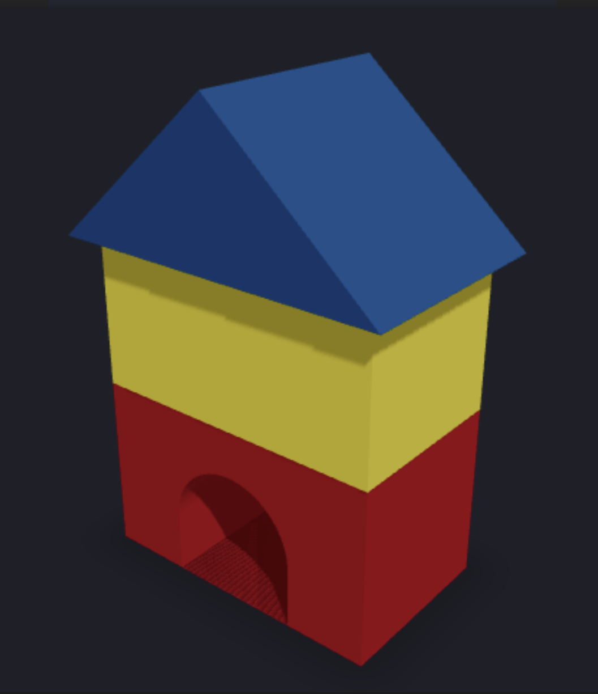
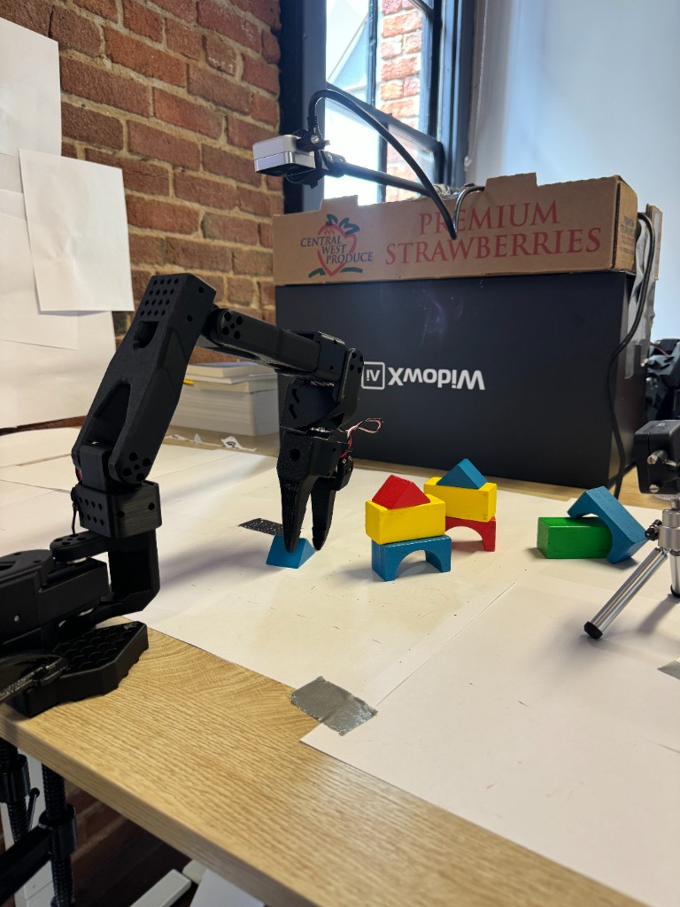

# SO-101 Rob the Builder, Robot Builder 

<p align="center">
  
</p>

A Python harness that turns one natural-language house request into short pick-and-place
skills for a [Seeed Studio SO-101](https://www.seeedstudio.com/) arm. It parses three colors,
plans three layers, and runs each instruction through a Modal-hosted policy (MolmoAct2, ACT, or
related servers). The policy runs until you pause from the UI /
voice controller (or a verification ran off of a camera), then you reset the scene by hand and continue to the next layer.

This repo is the house-building control layer. Robot drivers, calibration, and Modal deploy /
train scripts live in the vendored
[so100-hackathon](https://github.com/jaidevshriram/so100-hackathon) stack under
`third_party/so100-hackathon/` (upstream also:
[mission-robotics-ai/so100-hackathon](https://github.com/mission-robotics-ai/so100-hackathon)).

## Demo

<p align="center">
  
  <br>
  <em>Workspace: SO-101 follower, overhead (cam0) + side (cam1) cameras, colored blocks on the build mat.</em>
</p>

**House layer build run** (stacking):

https://github.com/gracexu24/embodiedmetalhack/raw/main/assets/demos/demo_build.mp4

<video src="assets/demos/demo_build.mp4" controls width="720"></video>


https://github.com/gracexu24/embodiedmetalhack/raw/main/assets/demos/demo_policy.mp4

<video src="assets/demos/demo_policy.mp4" controls width="720"></video>

If the embedded players do not render in your viewer, open the files under
[`assets/demos/`](assets/demos/).

## House and physical layout

Every house is exactly `door` (bottom), `wall` (middle), and `roof` (top). Colors are restricted
by layer:

| Layer | Allowed colors |
| ----- | -------------- |
| door  | red or blue    |
| wall  | yellow or green |
| roof  | red or blue    |

```text
Door blocks          Wall blocks            Roof blocks
Red door  Blue door | Yellow wall  Green wall | Red roof  Blue roof
```

Color order within each group can vary so the policy learns block identity, not one fixed
coordinate.

## Example requests

```text
Build a house with a red door, yellow walls, and a blue roof.
Make the door blue, the walls green, and the roof red.
I want a blue roof with green walls and a red door.
Create a blue-door, yellow-wall, red-roof house.
```

Parsing is deterministic, case-insensitive, and punctuation-tolerant. It accepts `wall` /
`walls` and either `red door` or `door red`. Missing, conflicting, or unsupported colors are
errors.

For a request like `red door, yellow walls, blue roof`, the planner emits:

```text
Pick up the red block and place it on the black rectangle.
Pick up the yellow block and stack it on the first red block.
Pick up the blue triangle block and stack it on the second yellow block.
```

## Architecture

```text
"Red door, green walls, blue roof"
                 ↓
          Sentence parser
                 ↓
     [red door, green wall, blue roof]
                 ↓
         Three-step planner
                 ↓
      Small build state machine
                 ↓
       Pick and place door  →  operator Pause
                 ↓
       Pick and stack wall  →  operator Pause
                 ↓
       Pick and stack roof  →  operator Pause
                 ↓
          Completed house
```

State machine (simplified):

```text
IDLE → CONNECTING → EXECUTING ⇄ (operator Pause / next layer)
                         ↓
                    COMPLETED
                         ↓
                      FAILED  →  retry last step (after human reset)
```

There is **no automatic home** at session start (the policy runs from the arm's current pose,
matching `deploy_policy.py`). There is **no automatic cam1 success gate** in the build loop by
default: MolmoAct2 never reports "task done", so the operator decides when a layer is finished
via **Pause**. Optional `features.camera_verification` still configures the HSV verifier for
experiments, but the current operator-paced path does not wait on it.

On Pause, torque is released so you can reset blocks by hand. The next layer re-enables torque
before driving again.

## Repository structure

```text
embodiedmetalhack/
├── README.md
├── requirements.txt
├── pyproject.toml
├── config.yaml
├── run.py                   # one-shot CLI build
├── voice_control.py         # staged voice / text commands
├── human_builder.py         # camera3 → harness sentence
├── human_builder_ui.py      # minimal laptop-camera detect UI (:8765)
├── simulate.py              # offline fake robot/policy loop
├── disarm.py                # panic: torque OFF on detected arms
├── release_torque.py        # panic: torque OFF via config.yaml robot
├── assets/
│   ├── block_house.png
│   └── demos/               # workspace photo + demo videos
├── backend/                 # FastAPI dashboard API (:8000)
├── frontend/                # React/Vite UI (:5173)
├── third_party/
│   └── so100-hackathon/     # vendored SO-100/101 driver + Modal scripts
├── src/house_builder/
│   ├── models.py
│   ├── parser.py
│   ├── planner.py
│   ├── robot.py
│   ├── policy.py
│   ├── state_machine.py
│   ├── verifier.py
│   ├── builder.py
│   ├── rr_time.py
│   ├── rr_blueprint.py
│   └── sync_checkpoint.py
└── tests/
```

## Setup

Sections 1–3 are enough for tests and parser/planner work. Sections 4–8 are required before
moving the real arm.

### 1. Prerequisites

- Python 3.11+
- Seeed Studio SO-101 follower on a serial port (for real builds)
- Cameras: overhead (`cam0`), side (`cam1`), optional model-house (`camera3`)
- Vendored driver at `third_party/so100-hackathon/` — install its pixi env once for hardware
  runs (`cd third_party/so100-hackathon && pixi install`)
- No local GPU needed for inference: policies run on Modal HTTP `/act` endpoints
- macOS PortAudio for voice: `brew install portaudio`  
  Debian/Ubuntu: `sudo apt-get install portaudio19-dev`

### 2. Clone and virtualenv

```bash
git clone https://github.com/gracexu24/embodiedmetalhack.git
cd embodiedmetalhack
python3.11 -m venv .venv
source .venv/bin/activate
python -m pip install --upgrade pip
```

### 3. Install this package

```bash
# Recommended: runtime + tests + voice + dashboard
python -m pip install -e ".[dev,voice,web]"

# Runtime only
python -m pip install -e .
```

| Extra   | Packages |
| ------- | -------- |
| runtime | `numpy`, `opencv-python`, `PyYAML`, `rerun-sdk` |
| dev     | `pytest`, `ruff`, `mypy` |
| voice   | `SpeechRecognition`, `PyAudio` |
| web     | `fastapi`, `uvicorn`, `websockets` |

```bash
pytest
ruff check .
mypy src/house_builder
```

### 4. Configure the robot

Edit `config.yaml`:

```yaml
robot:
  port: null                    # null = auto-detect calibrated follower USB serial
  calibration_dir: third_party/so100-hackathon/calibrations
  home_pose: [0, 0, 0, 0, 0, 0]
  max_step_deg: 10.0
  dry_run: true                 # start true; flip false only after a sane dry run
```

Validate joint ordering, gripper sense, stop, and home at low speed before policy rollouts.

### 5. Configure the policy endpoint

`MolmoAct2Policy` calls a Modal-hosted HTTP server (see
`third_party/so100-hackathon/tools/apps/`). Point `policy.server` at the deployment you want:

```yaml
policy:
  server: https://jaidevtrumpet--molmoact2-jags-lora-act.modal.run
  fps: 30.0
  execute_steps: 24
  jpeg_quality: 85
  skill_duration_seconds: 10
  check_interval_seconds: 3.0   # chunk length so Pause/Stop are noticed promptly
```

Each call sends the instruction, `cam0`/`cam1` frames (as `top`/`side`), and joint state.
`policy.load()` is a cheap reachability check, not a cold-start inference call.

### 6. Cameras

| Camera    | Role | Config |
| --------- | ---- | ------ |
| `cam0`    | policy observation (overhead / top) | `cameras.cam0` |
| `cam1`    | policy observation (side); optional HSV verification | `cameras.cam1` |
| `camera3` | human model-house scan | `cameras.camera3` |

Set OS capture `index` values in `config.yaml` (defaults 640×480 @ 30 FPS).

Optional feature flags:

```yaml
features:
  camera_verification: false  # HSV verifier config; build loop is operator-paced by default
  human_builder: false        # disable camera3 scan / UI panel; use sentence or color inputs
```

With `human_builder: false`, prepare builds from the dashboard sentence or color pickers. Both
paths produce  
`Build a house with a <door> door, <wall> walls, and a <roof> roof.`

### 7. Calibrate vision (if using camera3 / verification)

Pixel bands in `config.yaml` are examples. After cameras and the jig are fixed:

1. Build a correct reference stack.
2. Capture stills (`python human_builder.py --image saved.jpg` for camera3).
3. Set `min_y` / `max_y` (and `min_x` / `max_x` for human_builder) so bands match each layer.
   Image Y grows downward: door has the largest Y, roof the smallest.

Also tune `human_builder.hsv_ranges` under your lighting — yellow under a cool cast often sits
near hue ~14–19 on this camera.

### 8. Hardware Python path

`robot.py` imports `so100_hackathon` from the vendored tree. For real arm motion, run under
that pixi env with this repo's `src/` on `PYTHONPATH`:

```bash
export REPO=$(pwd)
export PYTHONPATH=$REPO/src
cd third_party/so100-hackathon
pixi install   # once
pixi run python "$REPO/run.py" "Build a house with a red door, yellow walls, and a blue roof." \
  --config "$REPO/config.yaml"
```

`simulate.py` and unit tests do **not** need the pixi env.

### Quick start

```bash
python -m pip install -e ".[dev,voice,web]"
pytest && ruff check . && mypy src/house_builder

# Offline fake loop (no arm / Modal)
python simulate.py

# One-shot build (needs PYTHONPATH + pixi as above)
python run.py "Build a house with a red door, yellow walls, and a blue roof."

# From a model-house image
python run.py "$(python human_builder.py --image model_house.jpg)"

# Voice or text staged build
python voice_control.py
python voice_control.py --text
```

## Human-built model input

```bash
python human_builder.py
# Build a house with a red door, green walls, and a blue roof.

python human_builder.py --image model_house.jpg
```

Standalone laptop-camera UI (preview + Detect button):

```bash
PYTHONPATH=src:. python human_builder_ui.py --camera-index 0 --port 8765
# open http://127.0.0.1:8765
```

The detector rejects missing or ambiguous colors rather than guessing.

## Voice / text staged commands

```bash
python voice_control.py          # microphone (needs network for Google recognizer)
python voice_control.py --text   # type the same commands
```

| Command | Effect |
| ------- | ------ |
| `Build this` | Scan camera3 (if enabled), store the build request; arm does not move |
| `start` | Connect / load policy, run the door layer until Pause |
| `build wall` | Run the wall layer until Pause |
| `build roof` | Run the roof layer until Pause, then close when complete |
| `retry last step` | After a failure + hand reset, re-run that layer (`retry` also works) |
| `stop` | Abort and disconnect safely |
| *(UI)* `Pause` | Stop the current policy loop, release torque for a hand reset |

## Web dashboard

```bash
python -m pip install -e ".[dev,voice,web]"

# terminal 1
uvicorn backend.main:app --reload --port 8000

# terminal 2
cd frontend && npm install && npm run dev   # http://localhost:5173
```

Buttons mirror voice: **Build This**, **Start**, **Build Wall**, **Build Roof**, **Pause**,
**Retry Last Step**, **Stop**. Reference scan uses `camera3`. Live monitoring uses the embedded
Rerun viewer.

## Panic utilities

If a killed backend leaves servos energized:

```bash
# Via house_builder robot wrapper + config.yaml
python release_torque.py

# Or scan all Feetech ports (needs so100_hackathon importable)
pixi run python "$REPO/disarm.py"   # from third_party/so100-hackathon

# Or ask a still-running backend to stop
curl -X POST -H 'Content-Type: application/json' \
  -d '{"command":"stop"}' http://localhost:8000/api/build/command
```

## Dataset

Training and evaluation use the LeRobot dataset
**[JaidevShriram/JAGS_v0_testing](https://huggingface.co/datasets/JaidevShriram/JAGS_v0_testing)**
([dataset card](https://huggingface.co/datasets/JaidevShriram/JAGS_v0_testing)):

| Field | Value |
| ----- | ----- |
| Robot | `so100_follower` |
| Episodes / frames (full card) | 253 episodes, 245,934 frames @ 30 FPS |
| Cameras | `observation.images.top`, `observation.images.side` (720×1280) |
| Action / state | 6-DoF: shoulder_pan, shoulder_lift, elbow_flex, wrist_flex, wrist_roll, gripper |
| Tasks | 10 language-conditioned pick-and-place skills |
| License | Apache-2.0 |

Related model checkpoint on the Hub:
[JaidevShriram/molmoact2-jags-ae](https://huggingface.co/JaidevShriram/molmoact2-jags-ae).

## Inference

Inference for this project is almost always **Modal-hosted policy servers** driven from
[so100-hackathon](https://github.com/jaidevshriram/so100-hackathon) (`pixi run deploy-policy`)
or from this harness (`config.yaml` → `policy.server`).

### Deployed endpoints used in this project

| Policy | Example task | Server |
| ------ | ------------ | ------ |
| **MolmoAct2 LoRA VLM** | Pick up the blue block and place it on the second yellow rectangle | `https://jaidevtrumpet--molmoact2-jags-lora-act.modal.run` |
| **ACT** | Pick up the red block and place it on the second yellow block | `https://jaidevtrumpet--act-jags-pick-red-block-act.modal.run` |
| **MolmoAct2 Action Expert** | Pick up the yellow block and place it on the second red block | `https://jaidevtrumpet--molmoact2-jags-ae-act.modal.run` |
| MolmoAct2 SO-101 scale | — | `https://jaidevtrumpet--molmoact2-so101-scale-act.modal.run` |
| Pi0.5 / SmolVLA API | — | `https://jaidevtrumpet--lerobot-pi05-smolvla-training-trained-policy-api.modal.run` |
| ACT train predict | — | `https://jaidevtrumpet--so101-act-train-actserver-predict.modal.run` |

From **so100-hackathon** (after `pixi install`):

```bash
# MolmoAct2 LoRA
pixi run deploy-policy -- \
  --task "Pick up the blue block and place it on the second yellow rectangle" \
  --server https://jaidevtrumpet--molmoact2-jags-lora-act.modal.run

# ACT (shorter chunk size often works better)
pixi run deploy-policy -- \
  --task "Pick up the red block and place it on the second yellow block" \
  --server https://jaidevtrumpet--act-jags-pick-red-block-act.modal.run \
  --execute-steps 10

# MolmoAct2 Action Expert
pixi run deploy-policy -- \
  --task "Pick up the yellow block and place it on the second red block" \
  --server https://jaidevtrumpet--molmoact2-jags-ae-act.modal.run
```

Point this harness at the same URL:

```yaml
policy:
  server: https://jaidevtrumpet--molmoact2-jags-lora-act.modal.run
```

## Training

Training does **not** live in this harness repo. Use the so100-hackathon / LeRobot / AllenAI
MolmoAct2 stacks below, then deploy the resulting checkpoint to Modal and set `policy.server`.

### Recommended MolmoAct2 base for SO-101

Use **`allenai/MolmoAct2-SO100_101`** when fine-tuning MolmoAct2 for SO-100/SO-101.

### Modal LoRA fine-tune (so100-hackathon)

```bash
GPU_COUNT=2 PYTHONIOENCODING=utf-8 PYTHONUTF8=1 \
pixi run modal run --detach tools/apps/finetune_modal_molmoact2_lora.py \
  --dataset-repo-id JaidevShriram/JAGS_v0_testing
```

Logs example:
[Modal app `ap-hMXYyB6VFhyMCqMgO1ufuA`](https://modal.com/apps/jaidevtrumpet/main/ap-hMXYyB6VFhyMCqMgO1ufuA?activeTab=logs).

### Torchrun / multi-GPU MolmoAct2 recipe (reference)

```bash
export EXP_NAME="molmoact2-my-robot-lora"

HF_ACCESS_TOKEN="${HF_ACCESS_TOKEN:-}" WANDB_API_KEY="${WANDB_API_KEY:-}" torchrun \
  --nnodes="${NNODES:-1}" --nproc-per-node=8 \
  --node_rank="${RANK:-0}" --master_addr="${ADDR:-127.0.0.1}" --master_port="${PORT:-29415}" \
  launch_scripts/train_lerobot.py \
  allenai/MolmoAct2 \
  my_robot \
  --wandb.name="${EXP_NAME}" --wandb.entity=<wandb-entity> --wandb.project=<wandb-project> \
  --max_duration=50000 \
  --device_batch_size=2 \
  --global_batch_size=64 \
  --num_workers=4 --pin_memory=true \
  --data.timeout=900 \
  --save_interval=200 \
  --save_num_checkpoints_to_keep=20 \
  --save_folder="checkpoints/finetune/${EXP_NAME}" \
  --packing=false \
  --dynamic_seq_len=true \
  --ft_vlm=true \
  --ft_action_expert=true \
  --ft_embedding=lm_head \
  --lora_enable=true \
  --lora_rank=64 \
  --llm_learning_rate=5e-5 \
  --vit_learning_rate=5e-5 \
  --connector_learning_rate=5e-5 \
  --action_expert_learning_rate=5e-5
```

Prefer starting from `allenai/MolmoAct2-SO100_101` for this robot family when that checkpoint
is available in your training entrypoint.

### Pi0.5 and SmolVLA (separate B300)

```bash
modal run modal_app.py::train \
  --dataset-url "https://huggingface.co/datasets/JaidevShriram/JAGS_v0_testing"
```

- API: `https://jaidevtrumpet--lerobot-pi05-smolvla-training-trained-policy-api.modal.run`
- Logs: [Modal app `ap-ldE0fOOUstQbPuHDS2iDOY`](https://modal.com/apps/jaidevtrumpet/main/ap-ldE0fOOUstQbPuHDS2iDOY?activeTab=logs)

### ACT

- Predict server: `https://jaidevtrumpet--so101-act-train-actserver-predict.modal.run`
- Logs: [Modal app `ap-iSSFTN4p717iOvZwSjFnwH`](https://modal.com/apps/jaidevtrumpet/main/ap-iSSFTN4p717iOvZwSjFnwH?activeTab=logs)
- Companion ACT-focused repo: [sheanrahman192/hackathonjustACT](https://github.com/sheanrahman192/hackathonjustACT)

### Fine-tuning language labels (collect / train with these)

Keep the same combined instructions the planner emits:

```text
Pick up the red block and place it on the black rectangle.
Pick up the blue block and place it on the black rectangle.

Pick up the yellow block and stack it on the first red block.
Pick up the yellow block and stack it on the first blue block.
Pick up the green block and stack it on the first red block.
Pick up the green block and stack it on the first blue block.

Pick up the red triangle block and stack it on the second green block.
Pick up the red triangle block and stack it on the second yellow block.
Pick up the blue triangle block and stack it on the second green block.
Pick up the blue triangle block and stack it on the second yellow block.
```

Record synchronized `cam0`, `cam1`, joint state, actions, gripper, instruction, and success
metadata. Keep door | wall | roof grouping, but vary color order within each group.

## Related repositories and experiment links

| Resource | Link |
| -------- | ---- |
| This harness | https://github.com/gracexu24/embodiedmetalhack |
| SO-100/101 driver + Modal apps (primary) | https://github.com/jaidevshriram/so100-hackathon |
| Upstream so100-hackathon (Rerun / mission-robotics) | https://github.com/mission-robotics-ai/so100-hackathon |
| ACT-focused hackathon fork | https://github.com/sheanrahman192/hackathonjustACT |
| Dataset | https://huggingface.co/datasets/JaidevShriram/JAGS_v0_testing |
| MolmoAct2 Action Expert checkpoint | https://huggingface.co/JaidevShriram/molmoact2-jags-ae |
| MolmoAct2 Action Expert serve | https://jaidevtrumpet--molmoact2-jags-ae-act.modal.run |
| MolmoAct2 LoRA VLM serve | https://jaidevtrumpet--molmoact2-jags-lora-act.modal.run |
| MolmoAct2 SO-101 scale serve | https://jaidevtrumpet--molmoact2-so101-scale-act.modal.run |
| Pi0.5 / SmolVLA API | https://jaidevtrumpet--lerobot-pi05-smolvla-training-trained-policy-api.modal.run |
| ACT predict | https://jaidevtrumpet--so101-act-train-actserver-predict.modal.run |

## Cam1 color-stack verification (optional)

When enabled and wired for experiments, verification segments red / yellow / blue / green in
`cam1` height bands (no ArUco). Wall/roof checks also look for the support color in the band
below. Color-only vision cannot prove physical shape identity — only that the requested color
occupies the expected band.

## Safety

- Research harness, not a certified safety controller.
- Use a physical E-stop, guarding, independent motion limits, and low initial speed.
- Keep people outside the workspace while torque is enabled.
- Test stop, home, disconnect, joint ordering, and action scaling before policy rollouts.
- Prefer `dry_run: true` until logged deltas look sane.
- Use `release_torque.py` / `disarm.py` if a crash leaves the arm energized.

## Testing

```bash
pytest
ruff check .
mypy src/house_builder
```

Tests cover parser variants and errors, planning, state transitions, builder success/failure
paths, voice command handling, and human_builder detection helpers.

## Credits

The SO-100 driver stack, Modal deployment / fine-tuning scripts, and calibration tooling under
`third_party/so100-hackathon/` are vendored from the **so100-hackathon** project
([jaidevshriram/so100-hackathon](https://github.com/jaidevshriram/so100-hackathon),
[mission-robotics-ai/so100-hackathon](https://github.com/mission-robotics-ai/so100-hackathon) /
[Rerun.io](https://rerun.io)). That code is used under its original **MIT / Apache-2.0** dual
license — see `third_party/so100-hackathon/LICENSE-MIT` and `LICENSE-APACHE`. Only source is
vendored; `recordings/`, `datasets/`, and `.pixi/` are regenerated locally with `pixi install`.

Dataset and many Modal training / serve jobs are by Jaidev Shriram and collaborators on
[JAGS_v0_testing](https://huggingface.co/datasets/JaidevShriram/JAGS_v0_testing). This
repository is the SO-101 house-builder harness layered on top of that stack.
